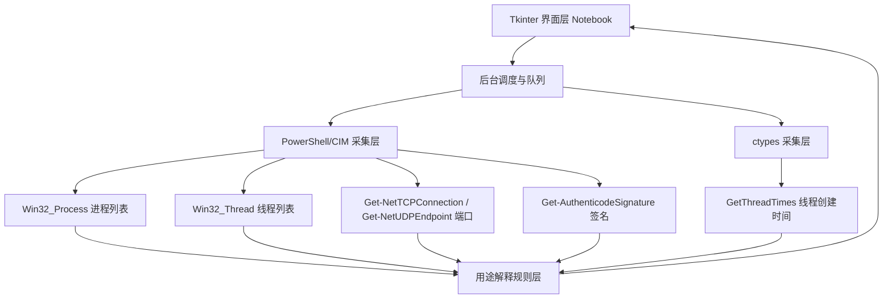
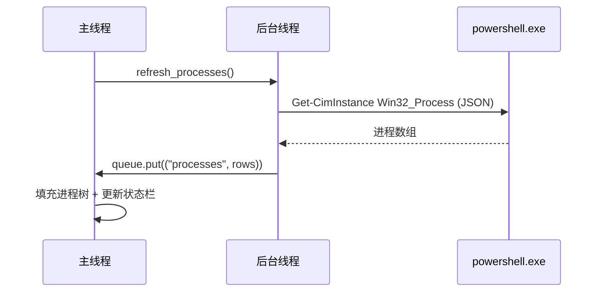
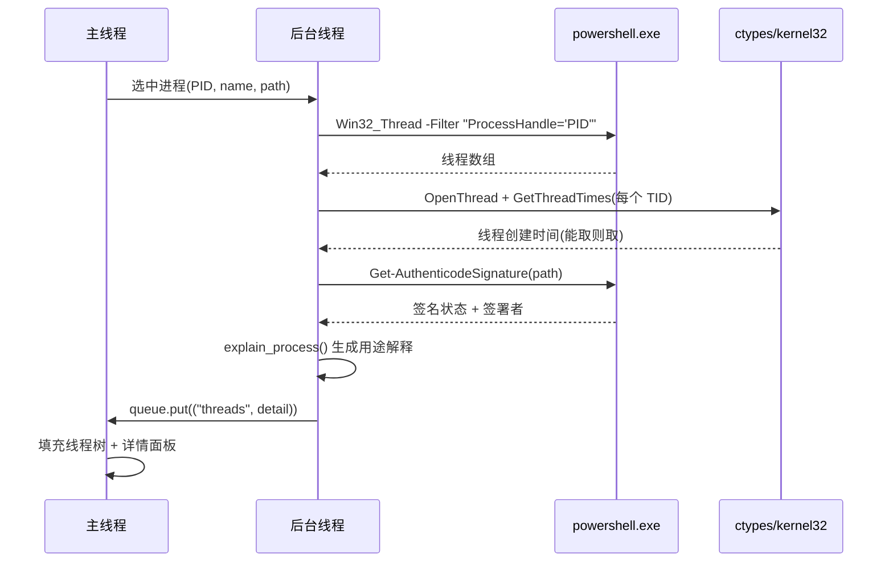
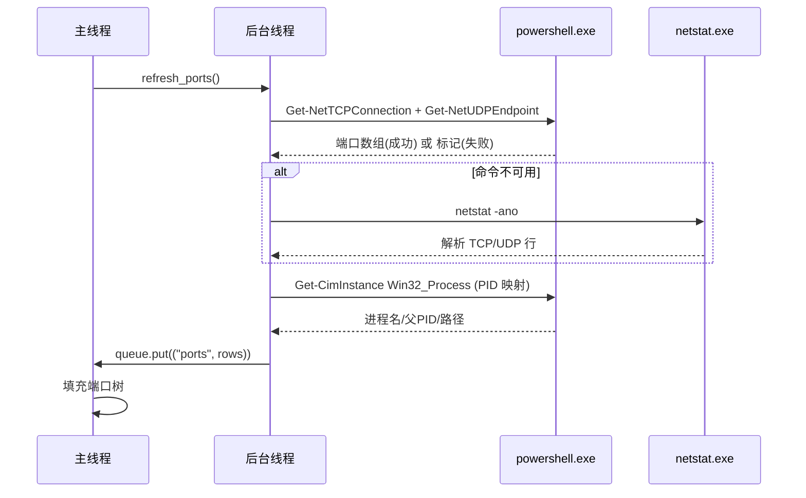
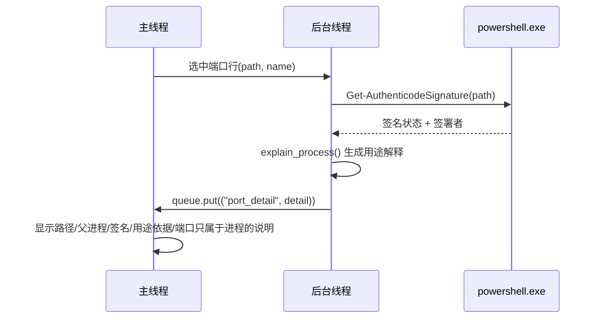

# WinScope Monitor 设计文档

Windows 进程、线程与端口监控工具

日期：2026-09-26

## 1. 目标与范围

实现一个 Windows 桌面监控工具，面向需要观察“哪些进程在跑、它们开了哪些线程、
打开了哪些 TCP/UDP 端口、来源是什么”的用户。监控与查看默认只读；用户明确点击并
确认后，允许结束选中的进程或线程；端口页只读，不提供关闭端口、停止监听或网络
修改动作。硬性约束：

- 界面用 Python 标准库 tkinter（Notebook 分页），尽量零第三方依赖。
- 监控真实 Windows 进程、线程与端口，至少给出 PID、进程名、线程 ID、线程状态、
  创建时间（能取则取）、父 PID、可执行路径，以及端口的协议、本地/远端地址端口、
  状态与所属 PID。
- 展示来源线索（路径、是否 Windows/System32、签名能取则取），并用透明规则
  生成中文用途解释，无法证实的内容标注“未知/需人工确认”。
- 自动刷新与后台刷新均不阻塞 UI。
- 进程、线程、端口表头支持点击升序/降序，刷新后保留排序状态。
- 结束进程/线程必须经过确认弹窗；不提供暂停、注入、提权或后台驻留。
- 对权限不足、进程退出、PowerShell 命令不可用做容错。

非目标：暂停、注入、提权、网络侧写、端口关闭/停止监听、持久化历史、远程监控、
跨平台。

## 2. 架构

程序是单进程、分层结构。共享的签名与用途解释逻辑抽到 `port_monitor.py`，避免
`thread_monitor.py` 与 `port_monitor.py` 之间循环导入：



模块职责：

- `thread_monitor.py`：主程序与 GUI，负责进程/线程采集、端口页、排序、结束操作、
  自测；从 `port_monitor` 导入共享的签名与用途解释函数。
- `port_monitor.py`：端口采集数据层，提供 `collect_ports()` 统一字典输出，并
  共享 `get_signature()`、`classify_path_clue()`、`quick_purpose()`、
  `explain_process()`、PowerShell 调用与 JSON 解析；不依赖 tkinter，也不反向导入
  `thread_monitor`。

分层职责：

- 界面层（`ThreadMonitorApp`）：进程树、线程树、端口树、详情面板、状态栏、自动
  刷新定时器、搜索过滤、Notebook 分页。
- 调度层：`threading.Thread` 后台执行采集，`queue.Queue` 把结果投递回主线程，
  主线程用 `root.after(100, ...)` 轮询队列，避免跨线程直接操作 Tk 控件。
- 采集层：`run_powershell()` 通过 `-EncodedCommand`（UTF-16LE + Base64）调用
  `powershell.exe`，规避路径/引号转义；`get_thread_creation_times()` 用 ctypes
  调 `kernel32.OpenThread` + `GetThreadTimes`；端口主路径为
  `Get-NetTCPConnection` / `Get-NetUDPEndpoint`，不可用时回退 `netstat -ano`。
- 解释规则层：`classify_path_clue()`、`quick_purpose()`、`explain_process()`
  均为纯函数，输入确定输出确定，便于测试。
- 管理层：`terminate_process()`、`terminate_thread()` 仅在确认弹窗通过后，
  用 `OpenProcess`/`OpenThread`、`TerminateProcess`/`TerminateThread` 和
  `CloseHandle` 执行一次性操作；结果回到主线程状态栏。
- 排序层：三个 Treeview 独立保存排序列和方向，数字、文本、时间分别排序，
  刷新时重新应用当前状态。

## 3. 数据流

### 3.1 进程列表刷新



一次 PowerShell 调用返回全部进程，避免逐进程查询。刷新期间置
`self.refreshing = True`，防止自动刷新与手动刷新叠加。

### 3.2 选中进程的线程详情



线程创建时间与签名按需、在后台线程中获取，避免界面卡顿。受保护进程（如
System、lsass）的线程句柄打开失败时，对应线程创建时间记为“未知”。

### 3.3 端口占用刷新（只读）



`collect_ports()` 返回统一字典：protocol、local_address、local_port、
remote_address、remote_port、state、pid、process_name、ppid、path、clue、
purpose、signature（另含 parent_name）。signature 采集时默认为 `None`，点击端口
行时再按需读取，避免批量签名查询拖慢刷新。

### 3.4 点击端口行的详情（只读）



端口页不提供终止或关闭动作；详情仅说明“端口仅属于进程，不代表线程”。

### 3.5 用户管理操作

用户选中进程或线程后点击管理按钮，界面先显示目标标识和风险确认框；取消则不
产生系统调用。确认后由后台线程调用 Win32 终止 API，关闭句柄并将成功或失败
原因投递回主线程。线程没有独立的可执行文件来源，线程详情展示其所属进程的
路径、父 PID、签名和用途解释。

## 4. 数据源与字段映射

| 字段 | 来源 | 备注 |
| --- | --- | --- |
| pid / name / ppid / 进程创建时间 / path | `Win32_Process` | `ParentProcessId`、`CreationDate`、`ExecutablePath` |
| 线程数 | `Win32_Process.ThreadCount` | 部分进程为 0 或缺失 |
| tid | `Win32_Thread.Handle` | 字符串形式的线程 ID |
| 线程状态 | `Win32_Thread.ThreadState` | 0-8，映射为中文 |
| 等待原因 | `Win32_Thread.ThreadWaitReason` | 0-19，映射为英文原名 |
| 优先级 | `Win32_Thread.Priority` | 直接展示 |
| 线程创建时间 | `kernel32.GetThreadTimes` | FILETIME 转本地时间；失败为 None |
| protocol / local_address / local_port | `Get-NetTCPConnection` / `Get-NetUDPEndpoint` | TCP 与 UDP 端点 |
| remote_address / remote_port / state | 同上（UDP 无连接状态） | TCP 状态映射为中文，UDP 显示“无(连接无关)” |
| 端口所属 pid | `OwningProcess` | 回退 netstat 时取 PID 列 |
| 端口进程名 / ppid / path | `Win32_Process` | 按 PID 映射 |
| parent_name | `Win32_Process` 二次映射 | 展示父进程名 |
| clue / purpose / signature | 规则层 + `Get-AuthenticodeSignature` | signature 按需读取 |
| 结束进程 | `OpenProcess` + `TerminateProcess` | 仅确认后执行；需要权限 |
| 结束线程 | `OpenThread` + `TerminateThread` | 仅确认后执行；可能导致所属进程崩溃 |

端口字段统一由 `collect_ports()` 输出，权限不足或字段缺失显示“未知/不可用”，
不抛异常。端口数据只读，不实现关闭端口、停止监听或网络修改。

## 5. 错误处理

- PowerShell 非零退出且无输出：抛 `RuntimeError`，界面状态栏显示失败信息，
  不影响程序存活。
- PowerShell 输出解析失败（混入 CLIXML、BOM 等）：`_parse_json()` 先整串解析，
  失败后从首个 `[`/`{` 截取再解析；脚本内用 `$ProgressPreference` /
  `$WarningPreference = 'SilentlyContinue'` 抑制进度流，保证 stdout 是纯 JSON。
- 端口命令不可用：`Get-NetTCPConnection` / `Get-NetUDPEndpoint` 任一整体失败时
  输出 `##NETSTAT##` 标记，采集层回退 `netstat -ano`，再按 PID 映射进程信息；
  netstat 行解析失败的行直接跳过，不影响其余行。
- 权限不足：`Win32_Process.ExecutablePath` 可能为空、`GetThreadTimes` 可能
  返回 False、签名可能不可用；均按“未知/不可用”降级，不抛异常。
- 进程退出：选中进程在采集期间退出时，`Win32_Thread` 返回空或 PowerShell 报错，
  后台线程捕获后提示“PID 可能已退出”。
- 签名模块加载：调用 `Get-AuthenticodeSignature` 前显式把
  `$env:PSModulePath` 重置为标准 Windows PowerShell 模块路径，避免宿主环境
  （如 Codex 运行时）注入的 PowerShell 7 模块路径导致
  `Microsoft.PowerShell.Security` 加载冲突（TypeData 重复定义）。
- 超时：`subprocess.run` 设置 `timeout`，避免 PowerShell 或 netstat 挂起拖死
  后台线程。
- 终止操作失败：将 Win32 错误码映射为权限不足、目标已退出或参数错误等
  可读提示；无论成功失败都在 `finally` 中关闭句柄。

## 6. 用途解释规则

规则顺序固定、确定性、可审计：

1. 名称命中内置表 → 提示为常见组件，依据“内置进程名规则”。
2. 路径在 `System32` / `SysWOW64` / Windows 目录 → 提示可能为系统组件，
   依据“路径规则”；若同时 Microsoft 签名有效，附加“签名规则(Valid/Microsoft)”。
3. 签名有效但非系统目录 → “已签名，可能为已安装软件”。
4. 未签名/签名异常 → 提示来源可信度未知。
5. 无命中 → “未知/需人工确认”。

名称规则只是提示，不是可信性结论，界面同时展示路径与签名供用户交叉判断。端口
的用途解释继承自所属进程，同一进程的多个端口共用同一份来源与签名信息。

## 7. 测试计划

### 7.1 数据层自测（已通过）

```bat
python thread_monitor.py --self-test
python port_monitor.py --self-test
```

验证点：进程列表数量 > 0；线程列表字段完整；`explorer.exe` 的线程创建时间
非“未知”；`explorer.exe` 签名返回 `Valid` 与 Microsoft 签署者；用途解释与依据
符合预期；端口采集返回 TCP 与 UDP 条数 > 0，字段完整。

### 7.2 手动测试

- 双击 `run_monitor.bat`，确认窗口标题为“WinScope Monitor | 进程、线程与端口监控”，
  进程列表在数秒内填充，端口页有数据。
- 搜索框输入 `explorer` 或 PID，确认进程过滤生效；端口页搜索协议、地址、端口、
  PID 或进程名，确认过滤生效。
- 选中 `explorer.exe`，确认线程列表与详情面板显示线程状态、创建时间、签名、
  用途解释。
- 选中 `System`（PID 4）或 `lsass.exe`，确认线程创建时间/路径/签名按“未知”
  降级而不是报错。
- 切换自动刷新间隔到 2 秒，确认不卡界面、状态栏时间更新。
- 点击进程、线程、端口各个表头，确认首次升序、再次降序，表头出现 `▲`/`▼`，
  刷新后排序状态保留。
- 点击端口行，确认显示协议、本地/远端地址端口、状态、PID、进程名、父 PID、
  来源路径、父进程、签名、用途依据，以及“端口仅属于进程，不代表线程”的说明；
  确认端口页没有关闭/停止按钮。
- 选择进程后点击“查看来源/作用”，确认显示路径、父 PID、签名和用途依据；
  选择线程后确认显示线程继承所属进程来源的说明。
- 对不存在的 PID/TID 做终止函数边界测试，确认返回可读错误且不影响真实进程。
- 结束一个已选中的外部进程后再次选中，确认提示“进程可能已退出”。

### 7.3 边界测试

- 无 `powershell.exe` 时（理论场景）：`_find_powershell()` 抛错，界面状态栏
  提示失败。
- 端口 cmdlet 不可用时：确认回退 `netstat -ano` 仍能显示端口。
- 大量线程进程（如 System 数百线程）与大量端口：确认树可滚动、后台线程不阻塞
  UI。
- 非 ASCII 路径/进程名（中文）：确认 JSON 以 UTF-8 正确解码、界面正常显示。

## 8. 已知限制与后续方向

- 线程创建时间依赖 `THREAD_QUERY_INFORMATION`，对受保护进程不可用。
- `Get-AuthenticodeSignature` 需要能加载 `Microsoft.PowerShell.Security`。
- 进程/线程/端口状态为瞬时快照，不保存历史趋势。
- 端口页只读；后续如需管理端口，应作为独立、显式授权的功能实现，并在界面中
  单独说明风险。
- 后续可增加：导出 CSV、按签名/路径/父进程/端口聚合视图、线程 CPU 时间。
